# mouseGradients

This repository contains code to reproduce all figures from our paper:

Fulcher, B. D., Murray, J. D., Zerbi, V., & Wang, X.-J. (2019).
[Multimodal gradients across mouse cortex](http://doi.org/10.1073/pnas.1814144116).
PNAS, 201814144.

## Downloading processed data
You will need to fill the `Data` directory with some processed data that you can download from [this figshare repository](https://figshare.com/articles/Mouse_cortical_gradients/7775684).

This paper would not have been possible without the generous sharing of open data (thank you!).
Please consult each original data source for detailed licensing information for each dataset.

Allen Institute gene-expression data was retrieved using [custom code](https://github.com/benfulcher/AllenSDK) that queries the [Allen SDK](https://github.com/AllenInstitute/AllenSDK).

## Figures

Figure 1A generated manually mouse-brain imaging software (by Valerio Zerbi).

### Figure 1B: T1w:T2w across all brain areas

```matlab
FunctionalClasses()
```
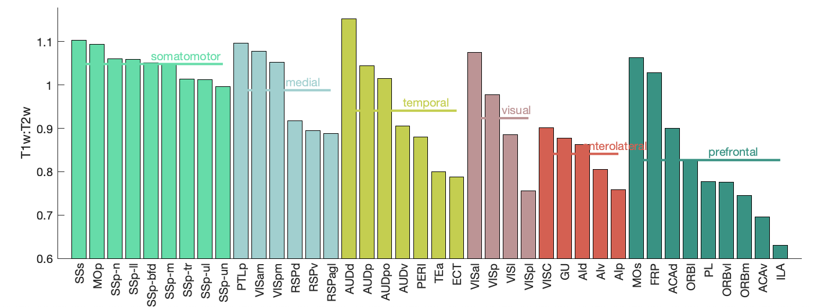

### Figure 1C-F: Scatter plots versus T1w:T2w

```matlab
T1T2Corrs()
```
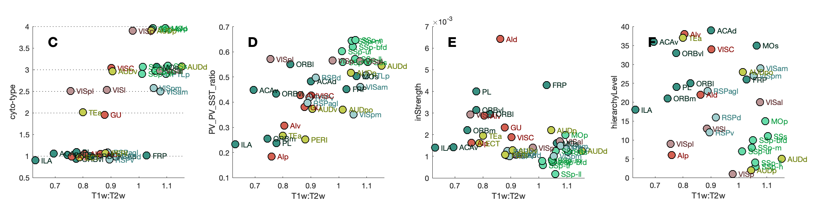

### Figure 2A,B: Zooming in on some manually-selected genes

```matlab
SpecificGeneFigure()
```

Note that B was removed from the final paper; which only plots the _Grin3a_ scatter
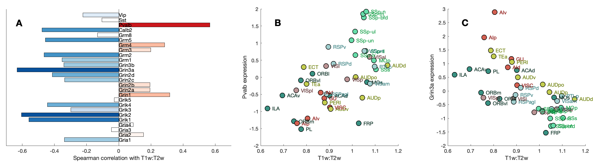

### Figure 2C: Low-dimensional projection

```matlab
MassAction('brainExpressed','scaledSigmoid','benCombo','bayesian')
```

Note that additional outputs are also produced, visualizing analytics about the principal components, including Fig.S4.
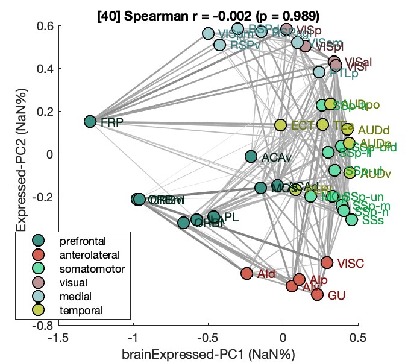


### Figure 3: Correlations across individual cortical layers

```matlab
LaminarPlot()
```

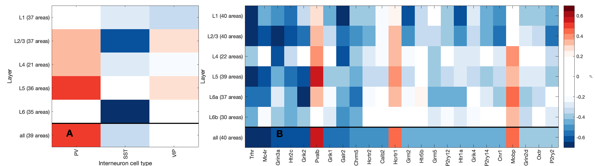

### Figure 4: Combination of diverse measurements

```matlab
DiverseMatrixT1T2()
PlotBigDamnMatrix()
```

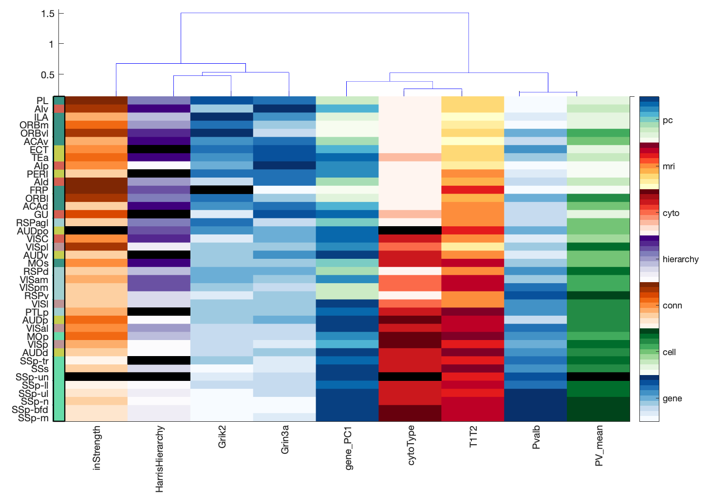


### Figure 5: Interspecies comparison

```matlab
G = LoadMeG('cortexAll');
HumanMouseComparisonAnal(G,'brainRelated','benCombo',true)
```

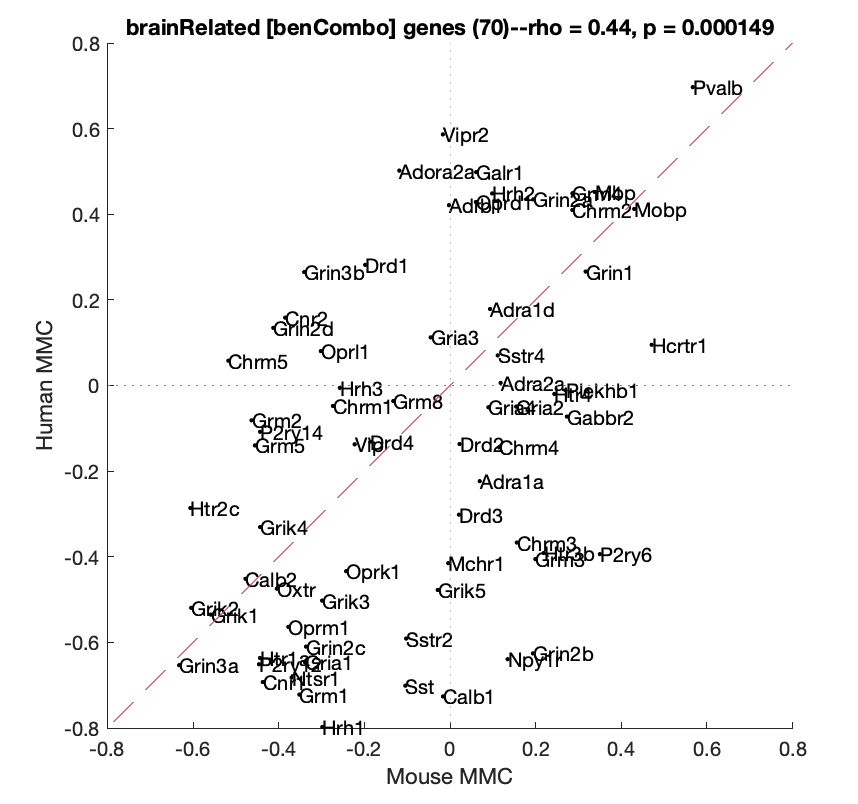

## Supplementary Figures

Figs S1, S2, S3 generated manually using mouse-brain imaging software (by Valerio Zerbi).

### Figure S4: Correlations of T1w:T2w with Principal Component projections of brain-expressed genes
```matlab
MassAction('brainExpressed','scaledSigmoid','benCombo','bayesian')
```
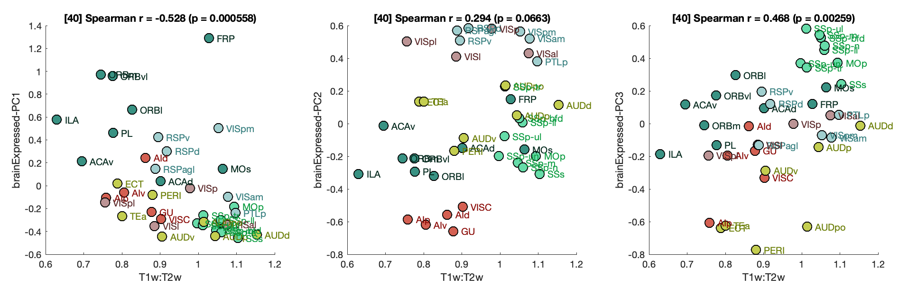


### Figure S5: Correlations between T1w:T2w values measured in individual cortical layers
```matlab
T1T2ByLayer
```
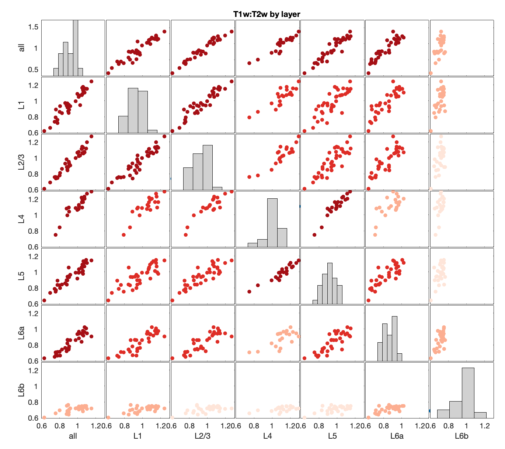

### Figure S6: Correlations to Ero et al. (2019) cell-density estimates
```matlab
MyelinCorrs('CellAtlas')
```
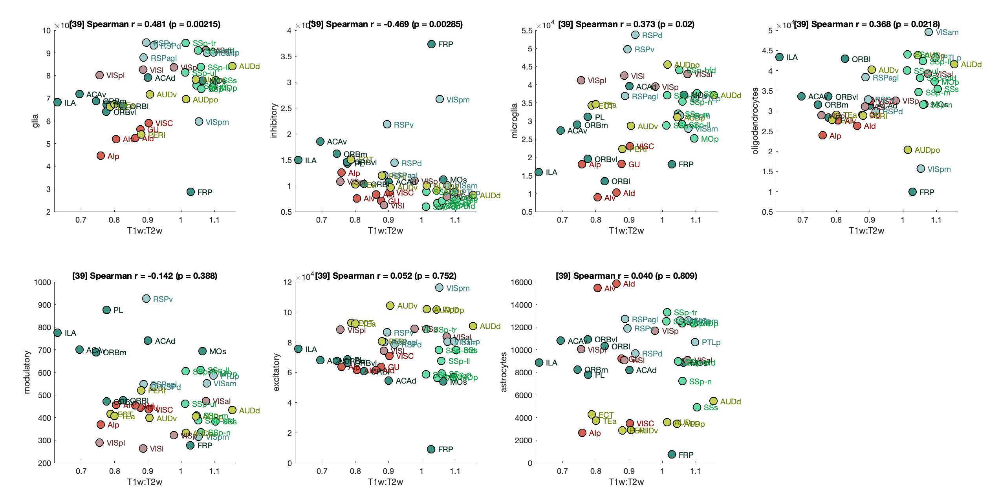

### Figure S7: Layer-specific gene-expression gradients

```matlab
TheBestLayers('genes',true,[]);
```

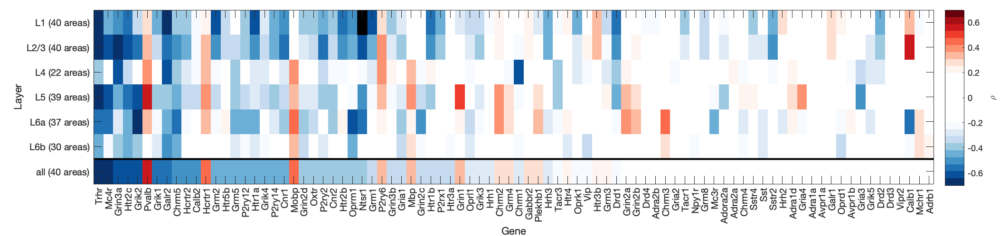

### Figure S8: Comparison of Harris hierarchy and T1w:T2w

```matlab
T1T2_or_hierarchy
```

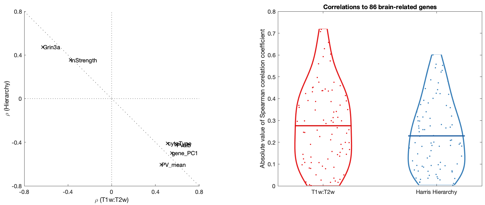

### Figure S9: Comparison of mouse-human correspondence as a function of expression processing and gene-set filtering

```matlab
whatGeneSets = {'all','brainExpressed','brainRelated','CahoyNeuron','CahoyOgligodendrocyte','CahoyAstrocyte','myelinSetOf999'};
whatSectionFilters = {'sagittal','coronal','combZ','benCombo','replicated'};
HumanMouseSectionCompare(whatGeneSets,whatSectionFilters);
```

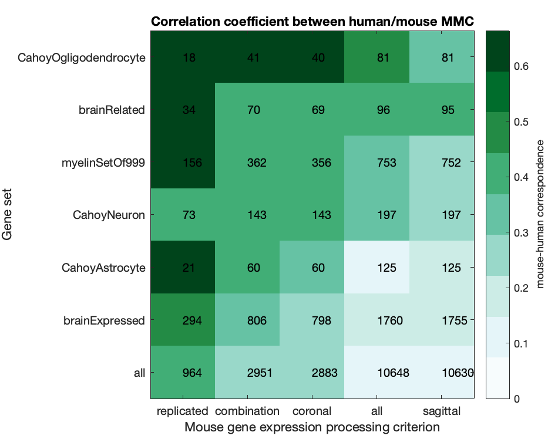
